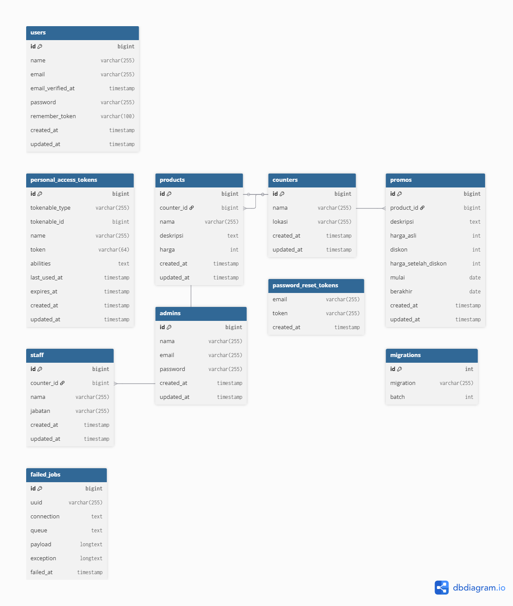
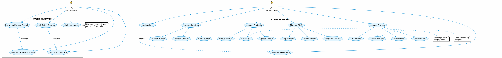

# Ria Busana 85 Website

**Sistem Manajemen Website Ria Busana 85**

[](https://laravel.com)
[](https://php.net)
[](STATUS.txt)

---

## 📋 Daftar Isi

-   [Tentang Project](#tentang-project)
-   [Fitur Utama](#fitur-utama)
-   [Tech Stack](#tech-stack)
-   [Struktur Database (ERD)](#struktur-database-erd)
-   [Entitas & Relasi](#entitas--relasi)
-   [Use Case Diagram](#use-case-diagram)
-   [Quick Start](#quick-start)
-   [Struktur Folder](#struktur-folder)
-   [API Routes](#api-routes)
-   [Halaman Publik & Admin Panel](#halaman-publik--admin-panel)

**📖 Panduan Setup Lengkap:** [SETUP_GUIDE.md](SETUP_GUIDE.md) | **🐳 Docker Setup:** [DOCKER_SETUP.md](DOCKER_SETUP.md)

---

## 📱 Tentang Project

Konsep dari website ini adalah, website yang digunakan untuk menggali informasi tentang Ria Busana 85.
Website ini menampilkan 1 halaman dengan Sistem sederhana. adapun beberapa fitur mulai dari:

-   Manajemen multiple counters/toko
-   Katalog produk dengan gambar
-   Sistem promosi & diskon berbasis periode
-   Manajemen staff per counter
-   Dashboard admin dengan statistik real-time
-   Autentikasi & akses admin terbatas

---

## ✨ Fitur Utama

### Untuk Pengunjung Website

-   ✅ Tampilan homepage modern dengan hero section
-   ✅ Katalog produk per counter dengan gambar
-   ✅ Sistem promosi & diskon aktif
-   ✅ Halaman detail counter dengan staff yang bekerja
-   ✅ Daftar staff umum perusahaan
-   ✅ Informasi kontak lengkap
-   ✅ Peta lokasi toko

### Untuk Admin

-   ✅ Login admin dengan autentikasi aman (1 tahun session)
-   ✅ Dashboard dengan statistik real-time:
    -   Total counters
    -   Total produk
    -   Total staff
    -   Total promo aktif
-   ✅ Manajemen Counters (CRUD)
    -   Tambah/edit/hapus counter
    -   Upload gambar
    -   Lihat detail counter
-   ✅ Manajemen Produk (CRUD)
    -   Tambah/edit/hapus produk
    -   Upload gambar produk
    -   Manage stok
    -   Assign ke counter
-   ✅ Manajemen Staff (CRUD)
    -   Tambah staff umum & staff counter
    -   Edit jabatan & informasi
    -   Hapus staff
-   ✅ Manajemen Promo (CRUD)
    -   Buat promosi berbasis periode
    -   Hitung diskon otomatis
    -   Manage durasi promo

---

## 🛠️ Tech Stack

### Backend

-   **Framework:** Laravel 10.x
-   **PHP:** 8.1+
-   **Database:** MySQL/MariaDB
-   **ORM:** Eloquent

### Frontend

-   **Template:** Blade (Laravel)
-   **CSS Framework:** Bootstrap 5
-   **CSS Utilities:** Tailwind CSS (config ready)
-   **Build Tool:** Vite
-   **JS Libraries:** Swiper, AOS (Animate On Scroll), GLightbox

### Additional Tools

-   **Authentication:** Laravel built-in auth + custom AdminAuth middleware
-   **Seeding:** Factory & Seeder untuk testing data
-   **Migration:** Database versioning dengan Laravel migrations

---

## 📊 Struktur Database (ERD)




---

## 🗂️ Entitas & Relasi

### 1. **ADMINS** (Admin Users)

| Field      | Type         | Constraint         | Keterangan            |
| ---------- | ------------ | ------------------ | --------------------- |
| id         | INT          | PK, Auto-increment | Identitas unik admin  |
| nama       | VARCHAR(255) | NOT NULL           | Nama lengkap admin    |
| email      | VARCHAR(255) | UNIQUE, NOT NULL   | Email untuk login     |
| password   | VARCHAR(255) | NOT NULL           | Password ter-hash     |
| created_at | TIMESTAMP    | -                  | Waktu dibuat          |
| updated_at | TIMESTAMP    | -                  | Waktu update terakhir |

**Relasi:**

-   1 Admin bisa membuat/manage banyak data

---

### 2. **COUNTERS** (Toko/Outlet)

| Field      | Type         | Constraint         | Keterangan             |
| ---------- | ------------ | ------------------ | ---------------------- |
| id         | INT          | PK, Auto-increment | Identitas unik counter |
| nama       | VARCHAR(255) | NOT NULL           | Nama counter/toko      |
| lokasi     | TEXT         | NOT NULL           | Lokasi geografis       |
| created_at | TIMESTAMP    | -                  | Waktu dibuat           |
| updated_at | TIMESTAMP    | -                  | Waktu update terakhir  |

**Relasi:**

-   1 Counter 🔗 Many Staff (1:N)
-   1 Counter 🔗 Many Products (1:N)

---

### 3. **PRODUCTS** (Katalog Produk)

| Field      | Type          | Constraint         | Keterangan                |
| ---------- | ------------- | ------------------ | ------------------------- |
| id         | INT           | PK, Auto-increment | Identitas unik produk     |
| counter_id | INT           | FK → counters      | Produk milik counter mana |
| nama       | VARCHAR(255)  | NOT NULL           | Nama produk               |
| deskripsi  | TEXT          | NULL               | Deskripsi detail produk   |
| harga      | DECIMAL(10,2) | NOT NULL           | Harga normal              |
| gambar     | VARCHAR(255)  | NULL               | Nama file gambar          |
| created_at | TIMESTAMP     | -                  | Waktu dibuat              |
| updated_at | TIMESTAMP     | -                  | Waktu update terakhir     |

**Relasi:**

-   Many Products 🔗 1 Counter (N:1)
-   1 Product 🔗 Many Promos (1:N)

---

### 4. **STAFF** (Karyawan)

| Field      | Type         | Constraint          | Keterangan                                |
| ---------- | ------------ | ------------------- | ----------------------------------------- |
| id         | INT          | PK, Auto-increment  | Identitas unik staff                      |
| counter_id | INT          | FK → counters, NULL | Null = Staff Umum; Filled = Staff Counter |
| nama       | VARCHAR(255) | NOT NULL            | Nama staff                                |
| jabatan    | VARCHAR(255) | NOT NULL            | Jabatan/posisi                            |
| created_at | TIMESTAMP    | -                   | Waktu dibuat                              |
| updated_at | TIMESTAMP    | -                   | Waktu update terakhir                     |

**Relasi:**

-   Many Staff 🔗 1 Counter (N:1, dengan counter_id nullable)
-   Staff dengan counter_id NULL = Staff Umum/General
-   Staff dengan counter_id = 1,2,3... = Staff Counter Spesifik

---

### 5. **PROMOS** (Promosi & Diskon)

| Field                | Type          | Constraint         | Keterangan                    |
| -------------------- | ------------- | ------------------ | ----------------------------- |
| id                   | INT           | PK, Auto-increment | Identitas unik promo          |
| product_id           | INT           | FK → products      | Promo untuk produk apa        |
| deskripsi            | TEXT          | NULL               | Deskripsi promosi             |
| harga_asli           | DECIMAL(10,2) | NOT NULL           | Harga sebelum diskon          |
| diskon               | INT           | NOT NULL (0-100)   | Persentase diskon             |
| harga_setelah_diskon | DECIMAL(10,2) | COMPUTED           | Harga final (auto-calculated) |
| mulai                | DATE          | NOT NULL           | Tanggal mulai promo           |
| berakhir             | DATE          | NOT NULL           | Tanggal berakhir promo        |
| created_at           | TIMESTAMP     | -                  | Waktu dibuat                  |
| updated_at           | TIMESTAMP     | -                  | Waktu update terakhir         |

**Relasi:**

-   Many Promos 🔗 1 Product (N:1)

**Business Logic:**

-   Harga Setelah Diskon = Harga Asli - (Harga Asli × Diskon%)
-   Promo ditampilkan jika: `today >= mulai AND today <= berakhir`

---

## 🎯 Use Cases & Alur Sistem

### Diagram Sistem



---

### Penjelasan Use Case

#### **PENGUNJUNG WEBSITE**

```
┌─────────────────────────────────────────┐
│         ALUR PENGUNJUNG                  │
├─────────────────────────────────────────┤
│                                         │
│  1. Lihat Homepage                      │
│     └─ Katalog produk per counter       │
│     └─ Promo aktif                      │
│     └─ Staff umum                       │
│                                         │
│  2. Lihat Counter Detail                │
│     └─ Produk spesifik counter          │
│     └─ Staff counter                    │
│                                         │
│  3. Lihat Promosi & Diskon              │
│     └─ Badge diskon %                   │
│     └─ Harga before & after             │
│     └─ Periode berlaku                  │
│                                         │
└─────────────────────────────────────────┘
```

#### **ADMIN PANEL**

```
┌─────────────────────────────────────────┐
│         ALUR ADMIN                      │
├─────────────────────────────────────────┤
│                                         │
│  1. LOGIN                               │
│     └─ Email & Password                 │
│     └─ Session 1 tahun                  │
│                                         │
│  2. DASHBOARD                           │
│     └─ Total counters                   │
│     └─ Total produk                     │
│     └─ Total staff                      │
│     └─ Promo aktif                      │
│                                         │
│  3. MANAGE COUNTERS                     │
│     └─ Tambah, edit, hapus counter      │
│                                         │
│  4. MANAGE PRODUCTS                     │
│     └─ Tambah, edit, hapus produk       │
│     └─ Upload gambar                    │
│     └─ Atur harga & counter             │
│                                         │
│  5. MANAGE STAFF                        │
│     └─ Tambah, edit, hapus staff        │
│     └─ Assign ke counter                │
│     └─ Atur jabatan                     │
│                                         │
│  6. MANAGE PROMOS                       │
│     └─ Buat promo untuk produk          │
│     └─ Set harga asli & diskon %        │
│     └─ Set periode (mulai-berakhir)     │
│     └─ Auto-calculate harga final       │
│                                         │
└─────────────────────────────────────────┘
```

---

## 🚀 Quick Start

### Prerequisites

-   **Option A (Docker - Recommended):** Docker Desktop
-   **Option B (Manual):** PHP 8.1+, MySQL, Composer, Node.js

### Option 1: Docker Setup (Recommended - 4 steps)

```bash
git clone <https://github.com/elfata123/website.git> && cd web-baru
cp .env.docker .env
docker-compose up -d
docker-compose exec app php artisan migrate:fresh --seed
# ✅ Done! Access at http://localhost
```

### Option 2: Manual Setup

```bash
git clone <https://github.com/elfata123/website.git> && cd web-baru
cp .env.example .env && php artisan key:generate
composer install && npm install
php artisan migrate:fresh --seed
npm run dev && php artisan serve
# ✅ Done! Access at http://localhost:8000
```

**Default Admin Credentials (Auto-seeded):**

-   Email: `admin@gmail.com`
-   Password: `password`

**📖 For detailed setup guide, see [SETUP_GUIDE.md](SETUP_GUIDE.md)**

---

✅ **Multi-Counter Management** - Kelola banyak outlet sekaligus  
✅ **Product Catalog** - Produk dengan gambar per counter  
✅ **Promo System** - Diskon berbasis periode (auto-calculate harga)  
✅ **Staff Management** - Staff umum & staff per counter  
✅ **Admin Dashboard** - Statistik real-time  
✅ **Image Upload** - Upload produk dengan validasi  
✅ **Session Auth** - Login with 1 year session lifetime  
✅ **Responsive Design** - Bootstrap 5 + Tailwind CSS

---

## 📱 Halaman Publik

| Halaman         | URL             | Deskripsi                    |
| --------------- | --------------- | ---------------------------- |
| Homepage        | `/`             | Katalog produk, promo, staff |
| Counter Detail  | `/counter/{id}` | Produk & staff per counter   |
| Staff Directory | `/staff`        | Daftar semua staff           |

---

## 🔧 Admin Panel

| Menu      | URL               | Fungsi                       |
| --------- | ----------------- | ---------------------------- |
| Dashboard | `/admin`          | Statistik & overview         |
| Counters  | `/admin/counters` | CRUD counters                |
| Products  | `/admin/products` | CRUD products + upload image |
| Staff     | `/admin/staff`    | CRUD staff                   |
| Promos    | `/admin/promos`   | CRUD promo & diskon          |
